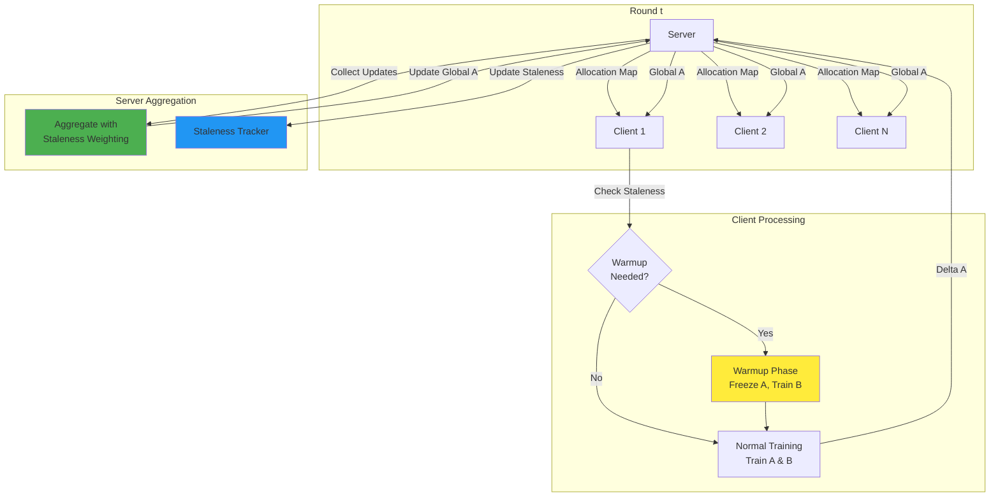

# Fed-HARP（原 FedAnon）联邦学习实验代码

本仓库包含基于 LoRA 的联邦学习实验实现，统一入口为 [main.py](file:///media/h3c/users/yanji/fed-a/main.py)。

## 统一入口（推荐）

统一启动格式：

```bash
python main.py --task <vision|roberta|flora|fedra> [-- <task-args>]
```

说明：
- `--task` 只在统一入口解析，其余参数会转发给对应任务的 argparse
- `--` 是可选的分隔符，推荐保留以避免参数歧义

常用命令：

```bash
python main.py --task vision -- --help
python main.py --task roberta -- --help
python main.py --task flora -- --help
python main.py --task fedra -- --help
```

## main 覆盖情况

- `main.py --task roberta` 调用 robertamain.py 的 `main(argv)`
- `main.py --task flora` 调用 floramain.py 的 `main(argv)`
- `main.py --task fedra` 调用 fedramain.py 的 `main(argv)`
- `main.py --task vision` 运行 main.py 内置的 vision 训练主循环

## Methodology

### Architecture Overview

Fed-HARP employs a Vision Transformer (ViT-Base) with custom LoRA layers injected into key components (attention and MLP layers). The LoRA decomposition follows:

$$W = W_0 + B \cdot A$$

where:
- $W_0$: Frozen base weight matrix
- $A \in \mathbb{R}^{r \times d}$: Shared matrix (aggregated by server, initialized with Gaussian)
- $B \in \mathbb{R}^{d' \times r}$: Personalized matrix (kept locally, initialized with zeros)
- $r$: LoRA rank (typically 8)

### Federated Learning Flow



### Mathematical Formulation

#### 1. LoRA Forward Pass

For a linear layer with input $x \in \mathbb{R}^{b \times d}$:

$$y = xW_0^T + \frac{\alpha}{r} \cdot xA^T B^T$$

where $\alpha$ is the LoRA scaling factor (typically 16.0).

#### 2. Client-Side Warmup

When client $i$ receives updated global $A_k$ for layer $k$ that was previously frozen:

**Step 1**: Freeze $A_k$, unfreeze $B_k$
$$A_k^{(i)} \leftarrow A_k^{global}, \quad \frac{\partial \mathcal{L}}{\partial A_k} = 0$$

**Step 2**: Train $B_k$ for $T_{warmup}$ steps:
$$B_k^{(i)} \leftarrow B_k^{(i)} - \eta_{warmup} \frac{\partial \mathcal{L}}{\partial B_k}$$

**Step 3**: Unfreeze both $A_k$ and $B_k$ for normal training.

#### 3. Server-Side Staleness-Weighted Aggregation

The server tracks staleness $\tau_{i,k}$ (number of rounds since client $i$ last updated layer $k$).

**Dampening Factor**:
$$\alpha_{i,k} = \frac{1}{\sqrt{1 + \tau_{i,k}}}$$

**Aggregation Rule**:
$$A_k^{global} \leftarrow A_k^{global} + \eta \sum_{i \in \mathcal{S}_k} \alpha_{i,k} \cdot \Delta A_{k}^{(i)}$$

where:
- $\mathcal{S}_k$: Set of clients that updated layer $k$ in this round
- $\Delta A_{k}^{(i)} = A_{k}^{(i,new)} - A_{k}^{(i,old)}$: Client $i$'s update for layer $k$
- $\eta$: Server aggregation learning rate (typically 0.1)

#### 4. Staleness Update

After each round:
$$\tau_{i,k} \leftarrow \begin{cases}
0 & \text{if client } i \text{ updated layer } k \\
\tau_{i,k} + 1 & \text{otherwise}
\end{cases}$$

### Non-IID Data Partitioning

The dataset is partitioned using a **Dirichlet distribution** with parameter $\alpha$:

$$p \sim \text{Dirichlet}(\alpha \cdot \mathbf{1}_N)$$

where $N$ is the number of clients. Lower values of $\alpha$ (e.g., 0.5) create more heterogeneous (Non-IID) distributions.

## Installation

### Prerequisites

- Python 3.8+
- CUDA-capable GPU (recommended) or CPU
- 8GB+ RAM

### Setup

1. **Clone the repository**:
```bash
cd /media/h3c/users/yanji/fed-a
```

2. **Install dependencies**:
```bash
pip install -r requirements.txt
```

3. **Verify installation**:
```bash
python -c "import torch; import torchvision; import timm; print('All dependencies installed successfully!')"
```

## Usage

### Basic Usage

Run Fed-HARP with default hyperparameters:

```bash
python main.py --task vision -- --help
```

### Custom Configuration

```bash
python main.py --task vision -- \
    --num_clients 10 \
    --num_rounds 50 \
    --allocation_ratio 0.5 \
    --alpha 0.5 \
    --lora_rank 8 \
    --lora_alpha 16.0 \
    --client_lr 0.001 \
    --batch_size 32 \
    --num_epochs 1 \
    --warmup_steps 10 \
    --aggregation_lr 0.1 \
    --eval_every 5 \
    --seed 42
```

### Command-Line Arguments

#### Dataset Arguments
- `--data_dir`: Directory for CIFAR-10 dataset (default: `./data`)
- `--alpha`: Dirichlet distribution parameter for Non-IID partitioning (default: `0.5`)

#### Model Arguments
- `--model_name`: ViT model name (default: `vit_base_patch16_224`)
- `--pretrained`: Use pretrained ImageNet weights
- `--lora_rank`: LoRA rank $r$ (default: `8`)
- `--lora_alpha`: LoRA alpha scaling factor (default: `16.0`)
- `--lora_dropout`: LoRA dropout rate (default: `0.0`)

#### Federated Learning Arguments
- `--num_clients`: Number of clients (default: `10`)
- `--num_rounds`: Number of federated rounds (default: `50`)
- `--clients_per_round`: Number of clients selected per round (default: all)
- `--allocation_ratio`: Fraction of layers each client updates (default: `0.5`)
- `--aggregation_lr`: Server aggregation learning rate $\eta$ (default: `0.1`)

#### Training Arguments
- `--batch_size`: Local batch size (default: `32`)
- `--client_lr`: Client learning rate (default: `0.001`)
- `--num_epochs`: Number of local epochs per round (default: `1`)
- `--warmup_steps`: Number of warmup steps for B-matrix alignment (default: `10`)
- `--warmup_lr`: Learning rate for warmup phase (default: `0.0001`)

#### Evaluation Arguments
- `--eval_every`: Evaluate every N rounds (default: `5`)
- `--test_batch_size`: Test batch size (default: `100`)

#### System Arguments
- `--seed`: Random seed for reproducibility (default: `42`)
- `--device`: Device to use (`cuda`/`cpu`, default: auto-detect)
- `--save_checkpoints`: Save model checkpoints
- `--checkpoint_dir`: Directory for checkpoints (default: `./checkpoints`)

### Example: Reproducing Paper Results

```bash
python main.py --task vision -- \
    --num_clients 10 \
    --num_rounds 100 \
    --allocation_ratio 0.5 \
    --alpha 0.5 \
    --lora_rank 8 \
    --client_lr 0.001 \
    --num_epochs 3 \
    --warmup_steps 10 \
    --aggregation_lr 0.1 \
    --eval_every 5 \
    --save_checkpoints \
    --seed 42
```

## Hyperparameters

### Default Hyperparameters

| Parameter | Value | Description |
|-----------|-------|-------------|
| `num_clients` | 10 | Number of federated clients |
| `num_rounds` | 50 | Total federated rounds |
| `allocation_ratio` | 0.5 | Fraction of layers per client |
| `alpha` (Dirichlet) | 0.5 | Non-IID distribution parameter |
| `lora_rank` | 8 | LoRA rank $r$ |
| `lora_alpha` | 16.0 | LoRA scaling factor $\alpha$ |
| `client_lr` | 0.001 | Client learning rate |
| `aggregation_lr` | 0.1 | Server aggregation rate $\eta$ |
| `batch_size` | 32 | Local batch size |
| `num_epochs` | 1 | Local training epochs |
| `warmup_steps` | 10 | B-matrix warmup steps |
| `warmup_lr` | 0.0001 | Warmup learning rate |

### Hyperparameter Tuning Guidelines

1. **LoRA Rank**: Higher rank (16-32) may improve performance but increases communication cost
2. **Allocation Ratio**: Lower values (0.3-0.4) simulate more constrained scenarios
3. **Warmup Steps**: Increase (15-20) for more aggressive B-matrix alignment
4. **Aggregation LR**: Lower values (0.05-0.1) provide more stable convergence

## Project Structure

```
fed-a/
├── models.py          # ViT model and custom LoRA layers
├── dataset.py         # CIFAR-10 dataset with Non-IID partitioning
├── client.py          # Client implementation (training, warmup, B persistence)
├── server.py          # Server implementation (allocation, staleness, aggregation)
├── main.py            # 统一入口（vision 训练主循环也在这里）
├── robertamain.py     # RoBERTa + GLUE（SST-2/QNLI）
├── floramain.py       # FLoRA 对比实验
├── fedramain.py       # FedRA 对比实验
├── experiment_drift_vis.py  # 漂移可视化实验
├── utils.py           # Utility functions
├── requirements.txt   # Python dependencies
└── README.md          # This file
```

## Key Implementation Details

### LoRA Layer Separation

The `LoRALinear` class explicitly separates $A$ and $B$ matrices:
- `get_A()` / `set_A()`: For server aggregation
- `get_B()` / `set_B()`: For local persistence (never uploaded)
- `freeze_A()` / `unfreeze_B()`: For warmup phase control

### Staleness Tracking

The server maintains a staleness matrix `staleness[client_id][layer_name]` that tracks how many rounds have passed since each client last updated each layer.

### Warmup Logic

When a client receives a new global $A$ for a previously frozen layer:
1. Freeze $A$, unfreeze $B$
2. Train for `warmup_steps` iterations
3. Unfreeze both and proceed with normal training

## Experimental Results

Expected performance on CIFAR-10 with ViT-Base:
- **Convergence**: ~30-50 rounds for stable accuracy
- **Final Accuracy**: ~85-90% (depending on hyperparameters)
- **Communication Efficiency**: ~95% reduction vs. full model updates (LoRA rank=8)

## Troubleshooting

### Common Issues

1. **Out of Memory**: Reduce `batch_size` or `num_clients`
2. **Slow Convergence**: Increase `num_epochs` or `client_lr`
3. **NaN Loss**: Reduce learning rates or check data loading

### Debug Mode

Add `--device cpu` to run on CPU (slower but easier to debug).

## Citation

If you use this code in your research, please cite:

```bibtex
@article{fedharp2024,
  title={Fed-HARP},
  author={Your Name},
  journal={Your Journal},
  year={2024}
}
```

## License

This project is licensed under the MIT License.

## Acknowledgments

- Inspired by FedSA-LoRA and Fed-HeLLo methods
- Built with PyTorch, timm, and torchvision
- CIFAR-10 dataset from torchvision

## Contact

For questions or issues, please open an issue on the repository.

---

**Note**: This implementation is a research prototype. For production use, additional optimizations and security considerations should be implemented.

## 示例命令

```bash
# Vision（CIFAR）
python main.py --task vision -- --dataset cifar10 --num_rounds 2 --num_clients 3 --num_epochs 1 --device cuda

# FLoRA（对比）
python main.py --task vision --dataset cifar100 --num_clients 20 --num_rounds 20 --device cuda --method fedharp_l --lora_ranks 16

# FedRA（对比）
python main.py --task fedra -- --dataset cifar10 --num_clients 20 --num_rounds 20 --device cuda

# RoBERTa（GLUE）
conda run -n fa_gpu python main.py --task roberta -- --dataset sst2 --num_clients 20 --num_rounds 20 --device cuda:1
```
